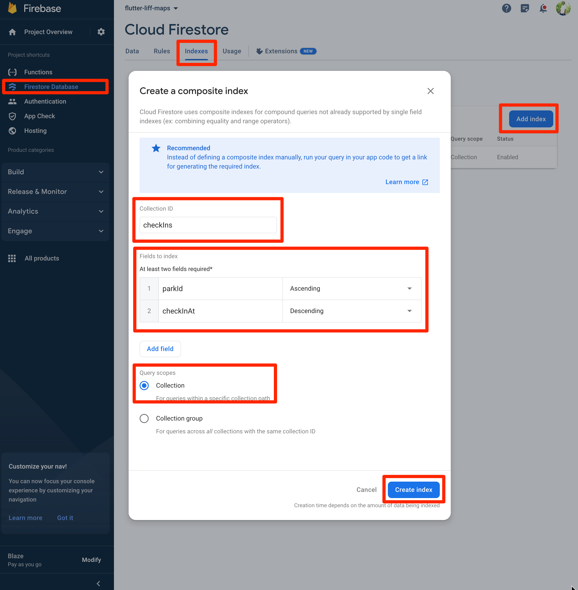

# flutter_liff_maps

```bash
fvm flutter --version
Flutter 3.10.2 • channel stable • https://github.com/flutter/flutter.git
Framework • revision 9cd3d0d9ff (6 days ago) • 2023-05-23 20:57:28 -0700
Engine • revision 90fa3ae28f
Tools • Dart 3.0.2 • DevTools 2.23.1
```

## ローカル環境での実行および開発の進め方

[FVM](https://fvm.app/docs/getting_started/in) を導入する。

```bash
brew tap leoafarias/fvm
brew install fvm
```

`.fvm/fvm_config.json` に Flutter SDK のバージョンが指定されているので、下記のコマンドを実行する。

```bash
fvm install
```

```bash
fvm flutter pub get
```

VS Code を使っている場合は、`.vscode/settings.json` の設定により、FVM の Flutter に同梱されている Dart SDK が使用されるようになっている。VS Code 以外を使用している場合は所望の通りに対応する。

ローカルホストの 8080 番ポートでデバッグ実行する。

```bash
fvm flutter run -d  web-server --web-port 8080 --dart-define-from-file=dart_define.json
```

ngrok をインストールする。

```bash
brew install ngrok
```

<https://dashboard.ngrok.com/> にアクセスしサインアップした後に、認証を行う。

```bash
ngrok config add-authtoken <your-auth-token>
```

ngrok でローカルホストの 8080 番ポートを一時公開（`fvm flutter run` しているターミナルとは別ターミナルで実行）する。

```bash
ngrok http 8080
```

ngrok を起動したターミナルで表示されている `Forwarding` の `https://<ランダム値>.ngrok.io`（または `https://<ランダム値>.ngrok-free.app`）の URL を LINE Developers コンソールから、LIFF > LIFF アプリ詳細の Endpoint URL に指定する。

上記の設定を済ませた上で、開発マシンで <http://localhost:8080>（Flutter Web のローカルホストの Web サーバ）にアクセスすると、LINE ログインが済んでいない場合は LINE ログインを促され、ngrok が払い出した URL にリダイレクトされる（ngrok の "You are about to visit..." のページが表示された場合は、自分の開発マシンの ngrok から払い出されたリンクであることを確認して "Visit Site" を押下して進む）。そうすると Flutter Web の画面が表示される。

ローカルで Flutter アプリのソースコードを編集したら、`fvm flutter run -d web-server --web-port 8080` をしたターミナルで `R` キーを押下してホットリロードすると、再起動した LIFF アプリもその編集内容が反映されるようになるので、そのようにしてデバッグすると良い。

## Firebase プロジェクトの設定

プロジェクトルートで下記のコマンドを実行し、Flutter Web アプリを Firebase プロジェクトと接続するための設定ファイルを生成する。

```sh
flutterfire configure
```

コンソール上でどの Firebase プロジェクトと接続するかを選択し、プラットフォームには Web を指定する。

すると、`lib/firebase_options.dart` というファイルが生成される。そのファイルの中には接続する Firebase プロジェクトの向き先の設定が記述されている。

なお、本サンプルリポジトリではすでにサンプル用の Firebase プロジェクトに紐づいた `firebase_options.dart` ファイルが存在している。自身のプロジェクトに接続したい場合は上書きするか、一度 `firebase_options.dart` ファイルを削除してから `flutterfire configure` コマンドを実行する。

### 環境変数や API キーなどの設定

現在のところでは、Flutter および Firebase Functions の開発・ビルドを行う上で下記の設定が必要となっている。

- `dart-define.json.template` をコピーして `dart-define.json` を作成し、`YOUR-LIFF-ID-HERE` の部分を実際の LIFF ID に差し替える。
- `web/index.sample.html` をコピーして `web/index.html` を作成し、`YOUR-API-KEY-HERE` の部分を実際の Google Maps API Key に差し替える。
- `functions/keys/service_account_key.json` を作成し、Firebase プロジェクトのサービスアカウントキーを反映する。
- `functions/.env.sample` をコピーして `functions/.env` を作成し、`YOUR-LINE-CHANNEL-ID-HERE` の部分を実際の Channel ID に差し替える。

### 複合インデックスの設定

このアプリでは、指定した公園 ID に対応するチェックイン一覧を取得するために、複合インデックスを作成する必要がある。

Flutter Web では、複合クエリのインデックスを自動で作成するための URLリンクがコンソールに表示されることはないので、手動で対応する必要がある。

たとえば、下図を参考に手動で設定することができる。



## 主な機能一覧

- 自分の近くにある公園を探すことができる。
- チェックインすることができる。
- 公園ごとにチェックインした人が見える。
- 友人がチェックインしたら通知が来る。
